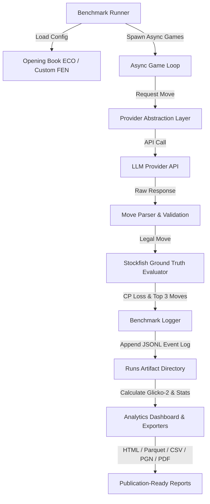

# ChessBench — LLM Critical Thinking & Reasoning Benchmark

> **The definitive, reproducible framework for evaluating Large Language Model reasoning through chess.**
> ChessBench converts chess into a structured cognitive benchmark: every move demands tactical calculation, long-term strategic planning, positional judgment, and clock management — the core competencies that define critical thinking in LLMs.

[](https://www.python.org/downloads/)
[](https://share.streamlit.io/deploy?repository=3bdrahman/chessbench&branch=main&mainModule=streamlit_app.py)
[](./tests/)
[](./pyproject.toml)
[](./pyproject.toml)
[](./Dockerfile)
[](./LICENSE)

---

## 🚀 Quick Navigation

- [Why Chess for LLM Benchmarking?](#-why-chess-for-llm-benchmarking)
- [Quick Start](#-quick-start)
- [Core Capabilities](#-core-capabilities)
- [Architecture & Workflow](#-architecture--workflow)
- [CLI Reference](#-cli-reference)
- [Benchmark Suites](#-benchmark-suites)
- [Statistical Methodology & ELO](#-statistical-methodology--elo)
- [Configuration & Environment](#-configuration--environment)
- [Export Formats](#-export-formats)
- [Contributing & Citation](#-contributing--citation)

---

## ♟️ Why Chess for LLM Benchmarking?

Static benchmarks like MMLU, GSM8K, and HumanEval face rapid saturation and severe data contamination risks. Chess is the **ideal dynamic reasoning benchmark** because it provides:

| Cognitive Capability | Chess Manifestation | Ground-Truth Measurement |
|---|---|---|
| **Tactical Calculation** | Finding forced mate sequences, tactics & forks | Move quality vs. Stockfish (centipawn loss) |
| **Strategic Planning** | Execution of long-term positional plans (10+ moves) | Plan coherence & positional evaluation tracking |
| **Positional Judgment** | Pawn structure control, outpost exploitation | Static positional evaluation delta |
| **Time Management** | Thinking time allocation under clock pressure | Latency vs. move quality pareto efficiency |
| **Adversarial Resilience** | Adapting to opponent tactical surprises | Blunder recovery rate & score maintenance |
| **Multi-Step Reasoning** | Tree search & candidate move generation | Structured thinking trace depth & keyword density |

> [!NOTE]
> Unlike static QA datasets, chess offers **infinite unique positions**, **deterministic ground truth (Stockfish engine)**, and **interactive adversarial dynamics** — making memorization mathematically impossible.

---

## ⚡ Quick Start

### 1. Web Arena UI (Streamlit Cloud or Local)
Deploy the live head-to-head arena app instantly to Streamlit Cloud with 1 click:

[](https://share.streamlit.io/deploy?repository=3bdrahman/chessbench&branch=main&mainModule=streamlit_app.py)

Or launch locally in your browser:
```bash
pip install -e .
streamlit run streamlit_app.py
```

### 2. Local CLI (Headless Benchmarking)
```bash
# Clone and install with development dependencies
git clone https://github.com/3bdrahman/chessbench.git
cd chessbench
pip install -e ".[dev]"

# Set API keys for target providers
export OPENAI_API_KEY="sk-..."
export ANTHROPIC_API_KEY="sk-ant-..."

# Run a 10-game tournament between GPT-4o and Claude 3.5 Sonnet
chessbench run \
  --players openai:gpt-4o anthropic:claude-3-5-sonnet-20241022 \
  --games 10 \
  --parallel 4 \
  --output runs/my_tournament

# View HTML report and export metrics
chessbench report runs/my_tournament --format html --open
```

### 3. Local Streamlit Arena UI
```bash
streamlit run streamlit_app.py
```

### 4. Containerized Run (Docker)
```bash
docker build -t chessbench .
docker run -it --rm \
  -v $(pwd)/runs:/app/runs \
  -e OPENAI_API_KEY \
  -e ANTHROPIC_API_KEY \
  chessbench run --players openai:gpt-4o anthropic:claude-3-5-sonnet-20241022 --games 10
```

---

## ✨ Core Capabilities

### 🔌 Integrated LLM Backends
Test models across providers through a unified async interface:
- **OpenAI**: GPT-4o, o1, o3-mini, GPT-4.1
- **Anthropic**: Claude 3.5 Sonnet, Claude 3.7 Sonnet (with Thinking budget)
- **Google**: Gemini 1.5 Pro, Gemini 2.0 Flash
- **OpenRouter**: 100+ open-weights and commercial models
- **NVIDIA NIM**: Hosted Llama, Qwen, Mistral endpoints
- **Groq**: Ultra-low-latency Llama & Mixtral inference
- **Together AI / Fireworks AI / DeepInfra**: Fast open-source provider backends

### 🏆 Bayesian ELO Ratings (Glicko-2)
Statistically rigorous rating system with full confidence bounds:
- Proper rating period batch updating (prevents order bias)
- 95% confidence intervals on all model ratings
- Head-to-head win/draw/loss crosstab analysis
- Convergence diagnostics and rating stability metrics

### 📊 Deep Per-Move Analytics
Every move is annotated with Stockfish engine analysis:
- **Centipawn Loss (CPL)**: Exact move quality loss vs. optimal engine move
- **Move Quality Classification**: `Best`, `Excellent`, `Good`, `Inaccuracy`, `Mistake`, `Blunder`
- **Reasoning Trace Parsing**: Extraction of tactical/strategic keywords, planning steps, and token counts
- **Latency & Token Efficiency**: Per-move input/output token usage tracking

---

## 🏗️ Architecture & Workflow



### Repository Structure

```
chessbench/
├── chessbench/
│   ├── benchmark/          # Tournament runner, Glicko-2, Stockfish evaluator & exporters
│   ├── cli/                # Click-based command-line interface (chessbench)
│   ├── common/             # Data types, exceptions, retry logic & rate limiting
│   ├── game/               # Async chess game engine with real-time clock tracking
│   ├── models/             # Position features, board analysis & thinking parser
│   ├── prompts/            # Demand-driven prompt templates
│   ├── providers/          # Provider abstractions (OpenAI, Anthropic, Gemini, etc.)
│   └── ui/                 # Streamlit Battle Arena UI & analytical dashboard
├── tests/                  # 295 automated unit and integration tests
├── Dockerfile              # Production multi-stage Docker build
├── pyproject.toml          # Package configuration & tool settings
└── streamlit_app.py        # Web app entry point
```

---

## 💻 CLI Reference

The `chessbench` command-line utility powers all automated benchmarking workflows.

### Commands Summary

| Command | Usage | Description |
|---|---|---|
| `chessbench run` | `chessbench run --config ...` | Execute tournament benchmark runs |
| `chessbench evaluate` | `chessbench evaluate -m ...` | Run adversarial calibration vs Stockfish depths |
| `chessbench report` | `chessbench report runs/my_run` | Generate HTML, Parquet, CSV, or PGN reports |
| `chessbench verify` | `chessbench verify runs/my_run` | Verify run reproducibility and SHA-256 hashes |
| `chessbench history` | `chessbench history` | List and browse completed benchmark runs |
| `chessbench models` | `chessbench models -p openai` | Query available models across providers |
| `chessbench config` | `chessbench config -o custom.yaml` | Generate benchmark YAML configuration file |

### Usage Examples

#### Run a Benchmark Tournament
```bash
chessbench run \
  --players openai:gpt-4o anthropic:claude-3-5-sonnet-20241022 google:gemini-1.5-pro \
  --games 20 \
  --parallel 4 \
  --opening-book eco_balanced \
  --output runs/frontier_tournament \
  --name "frontier_v1"
```

#### Adversarial Stockfish Depth Calibration
```bash
chessbench evaluate --model openai:gpt-4o --depths 8,12,16,20 --games 4
```

#### Export Results to HTML / Parquet
```bash
# HTML report with browser preview
chessbench report runs/frontier_tournament --format html --open

# Parquet export for DuckDB/Pandas analytical queries
chessbench report runs/frontier_tournament --format parquet --output analytics/
```

---

---

## 📈 Statistical Methodology & ELO

### Glicko-2 Bayesian Ratings
ChessBench implements the full Glicko-2 rating algorithm rather than raw Elo incremental updates:
- **Rating Period Batching**: Matches are grouped into rating periods to avoid order-dependent updates.
- **Rating Volatility ($\sigma$)**: Measures consistency in performance across opponents.
- **95% Confidence Intervals**: Every model rating is displayed with statistical error bounds ($\mu \pm 1.96 \times RD$).

```
=== FINAL LEADERBOARD ===
  openai:gpt-4o:                 1623.4 ± 42.1 (95% CI: 1541-1706)
  anthropic:claude-3.5-sonnet:   1587.2 ± 38.7 (95% CI: 1511-1663)
  google:gemini-1.5-pro:         1534.1 ± 45.3 (95% CI: 1445-1623)
```

---

## ⚙️ Configuration & Environment

### Sample `benchmark.yaml`
```yaml
time_control_seconds_per_move: 30
opening_book: "eco_balanced"
games_per_pairing: 10
colors: "alternating"

temperature: 0.0
max_tokens: 1500
reasoning_level: "mid"
seed: 42

max_parallel_games: 4
move_timeout_seconds: 120
game_timeout_seconds: 7200

players:
  - "openai:gpt-4o"
  - "anthropic:claude-3-5-sonnet-20241022"
  - "google:gemini-1.5-pro"
  - "openrouter:anthropic/claude-3.5-sonnet"

output_dir: "runs"
run_name: null
```

### Key Environment Variables

```bash
export OPENAI_API_KEY="sk-..."
export ANTHROPIC_API_KEY="sk-ant-..."
export GOOGLE_API_KEY="..."
export OPENROUTER_API_KEY="sk-or-v1-..."
export NIM_API_KEY="..."
export GROQ_API_KEY="gsk_..."
export TOGETHER_API_KEY="..."
export FIREWORKS_API_KEY="..."
export DEEPINFRA_API_KEY="..."
export STOCKFISH_PATH="/usr/bin/stockfish"
```

---

## 📊 Export Formats

ChessBench produces publication-ready research exports:

- **HTML Report**: Interactive dashboard with interactive board viewer, Glicko-2 chart, move quality heatmaps, and position evaluation graphs.
- **Parquet**: Columnar analytics format for instant DuckDB, Polars, and Pandas queries.
- **PGN + Eval**: Standard PGN files annotated with Stockfish evaluations and move commentary (compatible with Lichess and ChessBase).
- **JSON / CSV**: Raw game logs and tabular summary metrics.

---

## 🤝 Contributing & Citation

### Running Tests Locally
```bash
# Execute test suite (295 tests)
PYTHONPATH=. pytest tests/ -v

# Run type checker & linter
mypy chessbench/
ruff check chessbench/
```

See [CONTRIBUTING.md](./CONTRIBUTING.md) for contribution guidelines.

### Citation

If you utilize ChessBench in your research, please cite:

```bibtex
@software{chessbench2026,
  title = {ChessBench: LLM Critical Thinking & Reasoning Benchmark via Chess},
  author = {ChessBench Contributors},
  year = {2026},
  url = {https://github.com/3bdrahman/chessbench}
}
```

---

## 📜 License

Distributed under the MIT License. See [LICENSE](./LICENSE) for details.