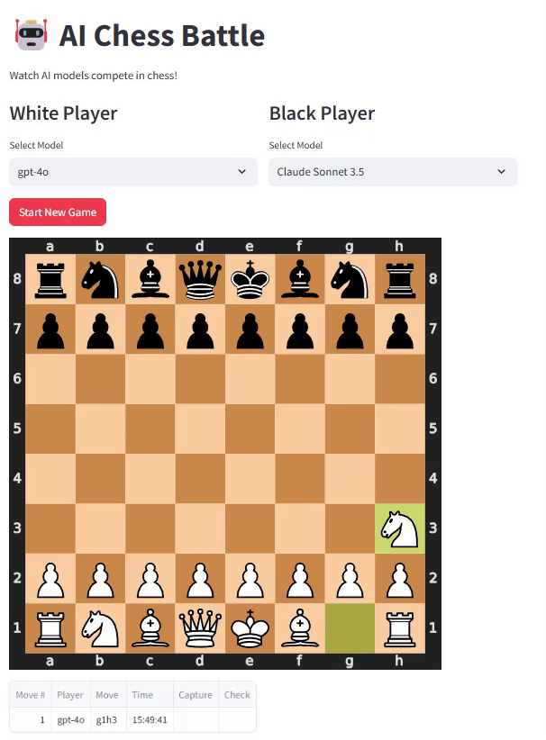

# AI Chess Battle

Watch AI models compete in chess! Select models from any provider and see them battle in real-time with live board updates, move tracking, and game statistics.

[](https://share.streamlit.io/deploy?repository=3bdrahman/chess_fight&branch=main&mainModule=streamlit_app.py)

## Quick Start

```bash
pip install -r requirements.txt
streamlit run streamlit_app.py
```

No API keys? Try the **Watch Demo Game** feature — replay recorded chess matches with full stats and animation.

## Key Features

- **Multi-Provider Support**: OpenAI, Anthropic, Google, NVIDIA NIM, OpenRouter, Groq, and Ollama
- **Async Live Updates**: Watch moves unfold in real-time with animated board
- **Cross-Provider Battles**: Pit any model against any other
- **Watch Demo Games**: Replay recorded matches instantly — no API key required
- **Comprehensive Statistics**: Capture tracking, check frequency, game duration, move history

## Demo



### Watch Demo Games (No API Key Required)

Built-in demo games let you see the full UI in action instantly:
- **Italian Game** — Tactical battle, White victory
- **Queen's Gambit** — Positional struggle, Black counter-attack
- **English Opening** — Long endgame draw
- **Reti Opening** — Sharp attacking play
- **Sicilian Defense** — Black mates

## Deployment

See [DEPLOYMENT.md](./DEPLOYMENT.md) for Streamlit Cloud deployment instructions.

## Providers

| Provider | Key Required | Notes |
|---|---|---|
| **OpenRouter** | `sk-or-v1-...` | 100+ models, free tier available |
| **Groq** | `gsk_...` | Fast inference, generous free tier |
| **OpenAI** | `sk-...` | GPT-4o, o1, etc. |
| **Anthropic** | `sk-ant-...` | Claude models |
| **Google** | via Google AI | Gemini models |
| **NVIDIA NIM** | NIM key | Self-hosted/cloud |
| **Ollama** | None | Local Llama/Qwen models |